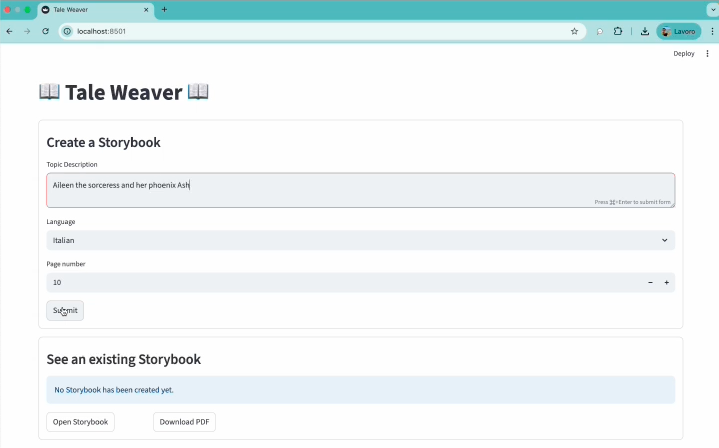
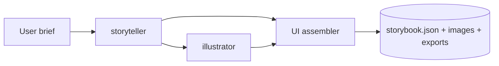

# ✨📖 Tale Weaver 📖✨

> Open-source **illustrated storybook** generator powered by **cooperating AI agents** on top of [CrewAI]. Inspired by Google’s *“Gemini Storybook”* concept, with a focus on transparency and self-hosting. It uses Google *Nano-Banana* model (gemini-2.5-flash-image-preview) to generate all illustrations.

---

## Demo

[](https://github.com/Angelus1383/tale-weaver/raw/refs/heads/main/media/Tale%20Weaver.mp4)


---

## Why

I was genuinely impressed by *Gemini Storybook* and its ability to build consistent, cohesive storybooks from just a few words. I was equally struck by *Nano-Banana*, Google’s new image-generation model, especially its character consistency. Together, they inspired Tale Weaver — an open-source application, powered by a small crew of collaborating AI agents, built with [CrewAI], with *Nano-Banana* handling image generation.

Short user brief → **complete storybook** (outline, scenes, image prompts, illustrations) produced end-to-end by specialized agents.

---

## Key Features

* **The Agent Crew**
  * `storyteller` — outline, plot, worldbuilding, tone, target age and per-scene image prompts (style, composition, palette) creation.
  * `illustrator` — generates illustrations by using a custom tool.
* **Full pipeline**: brief → outline & scenes & prompts → images → optional **PDF** export.
* **Model/backends flexibility**: LLMs (OpenAI/Gemini/Anthropic/Ollama) + Images (gemini-2.5-flash-image-preview a.k.a. Nano-Banana).
* **Structured outputs**: machine-readable `storybook.json` + assets on disk.
* **Character consistency**: reusable character sheets (traits, palette) + global style.

---

## How It Works



---

## Requirements

* Python **3.10+**
* At least one **LLM** and one **Image** backend (API keys or local endpoints)
* Docker installed (optional but recomended to a quick start)

---

## Installation

```bash
# 1) Clone the repo and enter into the project
git clone https://github.com/<your-org>/tale-weaver.git
cd tale-weaver

# 2) Edit the .env_example file and then rename as .env
nano .env_example
mv .env_example .env

# 3) Build the immage
docker build --no-cache -t tale-weaver:latest .

# 4) Create (only once) the Docker volume for /app/output
docker volume create tale-weaver-output

# 5) Start the container paying attention to pass the right path to the .env file
docker run --rm \
  --name tale-weaver \
  --env-file .env \
  -v tale-weaver-output:/app/output \
  -p 8501:8501 \
  tale-weaver:latest &

```

---

## Configuration (`.env`)

```env

# --- API KEY ---
GEMINI_API_KEY=...
OPENAI_API_KEY=...
# ANTHROPIC_API_KEY=...
# OLLAMA_BASE_URL=http://localhost:11434

# --- LLM ---
CREATIVE_MODEL=openai/gpt-4o
TOOL_MODEL=openai/gpt-4o

# --- Images Generation Model ---
GEMINI_IMAGE_MODEL=gemini-2.5-flash-image-preview

# --- Output Dir ---
OUTPUT_DIR=...
```

---

## Project Structure

```
tale-weaver/
├─ output/                  # output produced during elaboration
├─ src/                 
│  ├─ tale_weaver
│  │  ├─ config/            # storyteller / prompt_specialist / illustrator
│  │  │  ├─ agents.yaml     # agents definition and configurations
│  │  │  ├─ tasks.yaml      # tasks definition and configurations
│  │  ├─ model/          
│  │  │  ├─ storybook.py    # data model to use during elaboration
│  │  ├─ tools/
│  │  │  ├─ custom_tool.py  # custom tool to create illustraion through nano-banana model
│  │  ├─ utils/
│  │  │  ├─ tasks.yaml      # tasks definition and configurations
│  │  ├─ crew.py            # crew definition & orchestration
│  │  ├─ main.py
│  ├─ app.py                # streamlit application entrypoint
├─ .env
├─ Dockerfile
├─ LICENSE
├─ pyproject.toml
├─ README.md
├─ requirements.txt
└─ uv.lock

```

## Improvements
- Increase generation speed. Currently the whole pipeline requires around 4 minutes.
- Expose endpoint with FastAPI to decouple service from UI.
- Create a more attractive UI client.
- Introduce Docker-compose and split frontend and backend.

### Known Limits
- https://ai.google.dev/gemini-api/docs/image-generation#limitations

## License

MIT — see `LICENSE`.

---

## Credits & Inspiration

* *“Gemini Storybook”* idea (10 pages, illustrations, read-aloud)
* [CrewAI] Agent orchestration framework

[CrewAI]: https://github.com/joaomdmoura/crewAI
